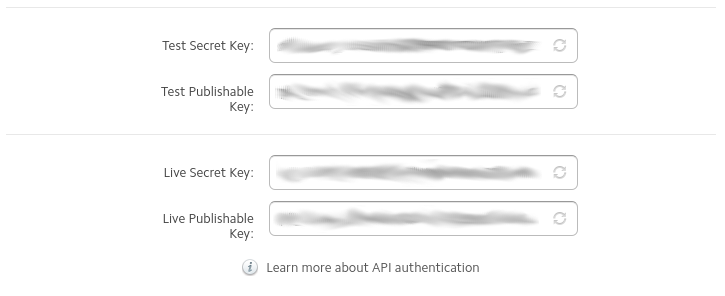

# Setup

To start using this module, you will need to do some setup first.

## Add Stripe Keys

Once setup, you will need to make the module aware of your Stripe
API keys.

First log into your Stripe account and find your API page (as below)



Now add these to your module config. You can do this in two possible ways:

### Silverstripe Configuration

You can add your api keys using the default [Silverstripe Configuration](https://docs.silverstripe.org/en/3/developer_guides/configuration/configuration/)

If you do this, the config variables are:

````
StripeForms.test_publish_key
StripeForms.live_publish_key
StripeForms.test_secret_key
StripeForms.live_secret_key
````

### Enviromental Config

You can alternativley set the keys up in your [_ss_environment.php](https://docs.silverstripe.org/en/3.2/getting_started/environment_management/)
file.

If you use environmental config, you will need to add the following to your `_ss_environment.php`:

````
<?php
...

// Stripe Keys for Stripe Forms module
define("STRIPE_TEST_SK", "Test Secret Key");
define("STRIPE_TEST_PK", "Test Publishable Key");
define("STRIPE_LIVE_SK", "Live Secret Key");
define("STRIPE_LIVE_PK", "Live Publishable Key");

````

### Test VS Live

While the site is in [dev mode](https://docs.silverstripe.org/en/3/developer_guides/debugging/environment_types/)
the test key's will be used.

As soon as you switch the site to stage or live, the live key will be used instead.

## Webhooks

There is a dedicated page of docs for integrating with [Stripe webhooks](webhooks.md)